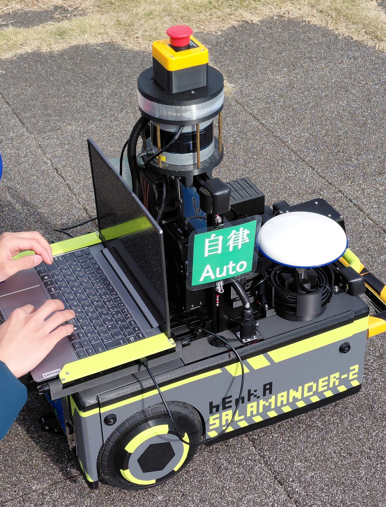
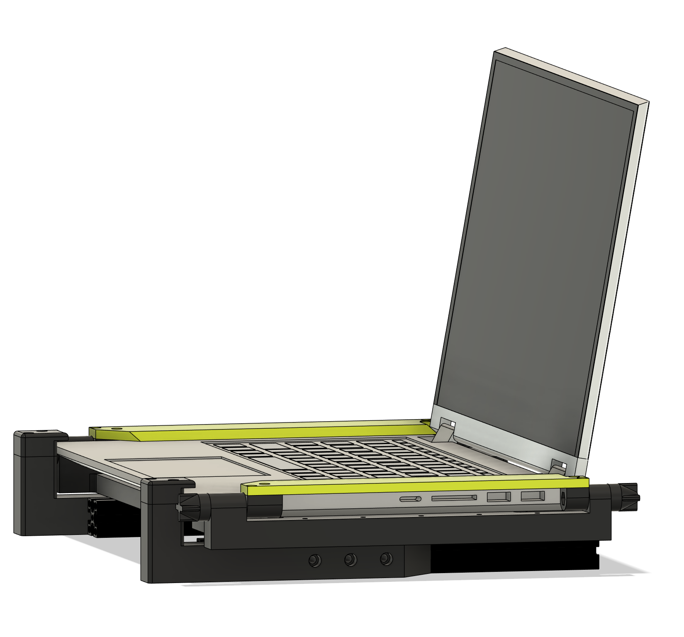
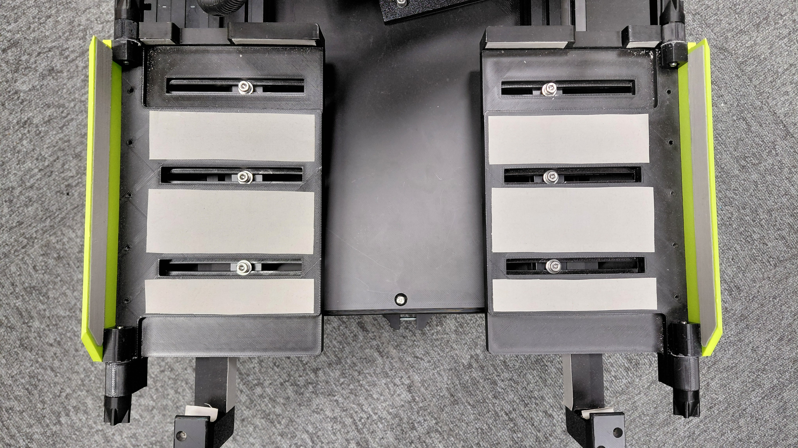
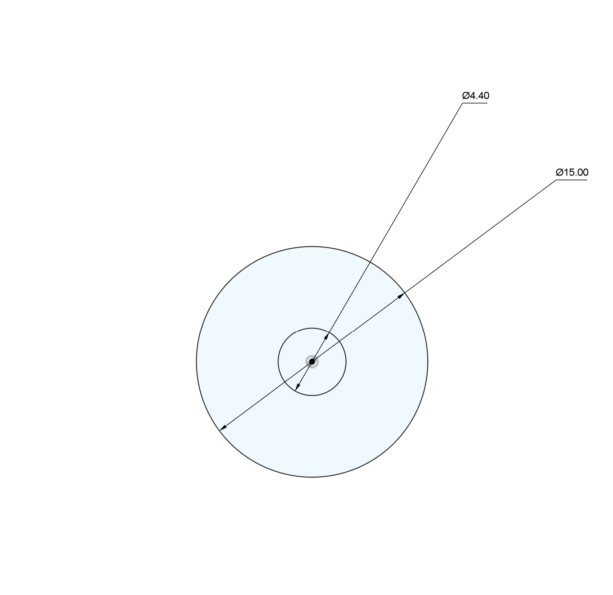
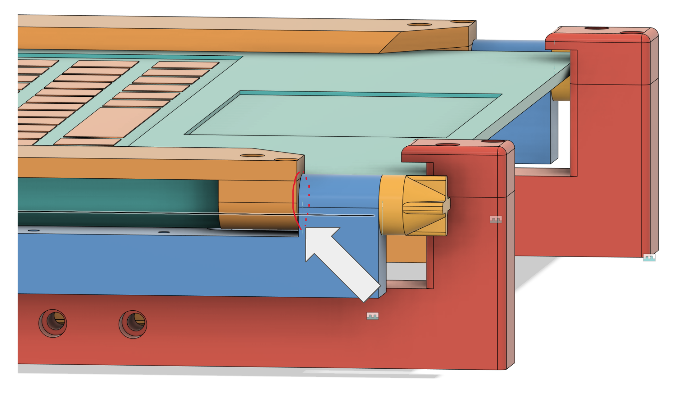

# Easy PC Dock

ロボット用のPCホルダです．つくばチャレンジの際、ノートPCをロボットに何度も装着するのが煩わしかったため開発しました．

動画のように工具不要でつまみを回すだけでPCを取り付けが可能で，更にUSBポートも塞ぎません．また，様々な大きさPCに適合できるサイズ調整可能な設計になっています．

直接ノートPCを載せないといけないロボット開発の際にご活用ください．

https://github.com/user-attachments/assets/c65e7dbc-58c8-4bc7-97fe-0ea375c54227

# 特徴

- 工具不要でつまみを回すだけでPCを取り付け・取り外し可能
- 様々なPCに合わせて大きさを調整可能
- 装着中もUSBポートを塞ぎません

<table width="100%">
  <tr>
    <td width="50%" align="center" valign="bottom">
      <!-- 画像（最大サイズ内で自動調整） -->
      
      
搭載例

    </td>
    <td width="50%" align="center" valign="bottom">
      
      
左右のUSBポートを確保

    </td>
  </tr>
</table>

# BOM

| 部品名 | 数量 | URL |
| --- | --- | --- |
| M4✕25 六角頭ボルト | 2 | [TRUSCO(トラスコ) 六角ボルト 三価 白 全ねじM4x25 46本入 B722-0425](https://www.amazon.co.jp/dp/B08W1Q5QJ7?ref_=ppx_hzsearch_conn_dt_b_fed_asin_title_1) |
| M4✕40 六角頭ボルト | 2 | [TRUSCO(トラスコ) 六角ボルトステンレス全ネジ M4×40 35本入 B23-0440](https://www.amazon.co.jp/dp/B002A5NRL2?ref_=ppx_hzsearch_conn_dt_b_fed_asin_title_2) |
| M4ナット | 4 | [なべ小ねじ 728 PCS 錆びない ボルト ナット セット](https://www.amazon.co.jp/dp/B0B4SCY2TF?ref_=ppx_hzsearch_conn_dt_b_fed_asin_title_5&th=1) |
| M3✕10 タッピングビス | 12 |[トラスコ中山(TRUSCO) 皿頭タッピングねじ 1種A ステンレス M3×10 20本入 少量パック Y836-0310](https://www.amazon.co.jp/%E3%83%88%E3%83%A9%E3%82%B9%E3%82%B3%E4%B8%AD%E5%B1%B1-TRUSCO-%E7%9A%BF%E9%A0%AD%E3%82%BF%E3%83%83%E3%83%94%E3%83%B3%E3%82%B0%E3%81%AD%E3%81%98-%E3%82%B9%E3%83%86%E3%83%B3%E3%83%AC%E3%82%B9-Y836-0310/dp/B0BSLB8NYC) |
| M4×12 アルミフレーム用ボルト | 6 | [座金組み込み六角穴付ボルト/ステンレス製 (M4) 長さ12mm 1パック(50個) CSWS-04-12-P50](https://www.monotaro.com/p/0840/6816/) |
| ノンスリップシート | 1 | [HINODE すべり止めシート ノンスリップシート](https://www.amazon.co.jp/dp/B0DM8LZJDD?ref_=ppx_hzsearch_conn_dt_b_fed_asin_title_1&th=1) | 
| 両面テープ | 1 | 適宜購入 |

# 組み立て方法

1. stepファイルの[assembly.step](/step/assembly.step)を参考にしてください．

2. ノンスリップシートを適宜base部品に両面テープで接着してください．

<table width="100%">
  <tr>
    <td width="50%" align="center" valign="bottom">
      
      
ベースへの貼り方

    </td>
    <td width="50%" align="center" valign="bottom">
      
      
クランプへの貼り方

    </td>
  </tr>
</table>

3. ノンスリップシートを円形に切り取り，中心に穴を開けて，M4のネジに通し，clampとbaseの隙間に入れてください．ネジを締めると摩擦により固定されます．

<table width="100%">
  <tr>
    <td width="50%" align="center" valign="bottom">
      
      
円形の寸法

    </td>
    <td width="50%" align="center" valign="bottom">
      
      
取り付け位置

    </td>
  </tr>
</table>

4. PCが分厚い場合，[clamp_L_22mm.step](/step/clamp_L_22mm.step)等の高さの大きいものを印刷してください．この数字はPC底面からの厚みを示しています．

## 免責

本データの使用または使用不能に起因して発生した，人身事故，PCやロボット等の機器の破損，データ損失，業務停止，その他いかなる直接的・間接的損害についても，作者は一切の責任を負いません．

また，本製品は安全装置・落下防止装置としての使用や，振動・衝撃・屋外環境での長時間運用を保証するものではありません．
使用環境・用途に応じて，十分な安全確認および対策を行った上でご利用ください．

## License
This project is licensed under **CC BY-NC-SA 4.0**.
(本プロジェクトは **CC BY-NC-SA 4.0** ライセンスです。)

- ✅ **Free for Research:** Modification & redistribution allowed for non-commercial use.
  (研究目的での改変・再配布は自由です。)
- 🔄 **ShareAlike:** Modified versions must be distributed under the **same license**.
  (改変して配布する場合、同じライセンスを継承する必要があります。)
- ❌ **No Commercial Use:** Commercial use is prohibited without permission.
  (商用利用は禁止です。)

## Commercial Inquiries (商用利用の相談)
For commercial licensing, please contact:
商用利用をご希望の場合は下記までご連絡ください。

DM **[https://x.com/hEnka_robots]**
